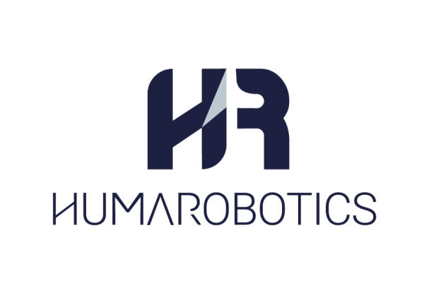

# Doosan Linak

  <a href="./README.md">English</a> •
  <a href="docs/README-fr.md">Français</a>

--------------

## Description

**Linak** program is an interface allowing to use a Linak Modbus TCP/IP actuator with a Doosan robot.

This project is developped by [HumaRobotics](https://www.humarobotics.com/).

## Requirements
- A **Doosan Robot**
- A **Linak Modbus TCP/IP actuator**

## How to use

- Configure the IP of the robot to match the subnetwork "192.168.1.X".

- Create a `Custom Code` and import the [linak.py](./linak.py) file (replace .py by .txt to import in the Doosan).

- Then, look at the examples in the "examples" folder to see how to use the Linak class. You can begin with importing the [ex_basic.py](./examples/ex_basic.py) into the Doosan.

## Examples

- [ex_basic.py](./examples/ex_basic.py): Basic example showing how to use the Linak class.

## License

Doosan-Linak is released under the Apache V2.0 License. See the [LICENSE](./LICENSE) file file for details.

## Support

If you encounter any issue or have any questions/comments, feel free to contact us at support@humarobotics.com

